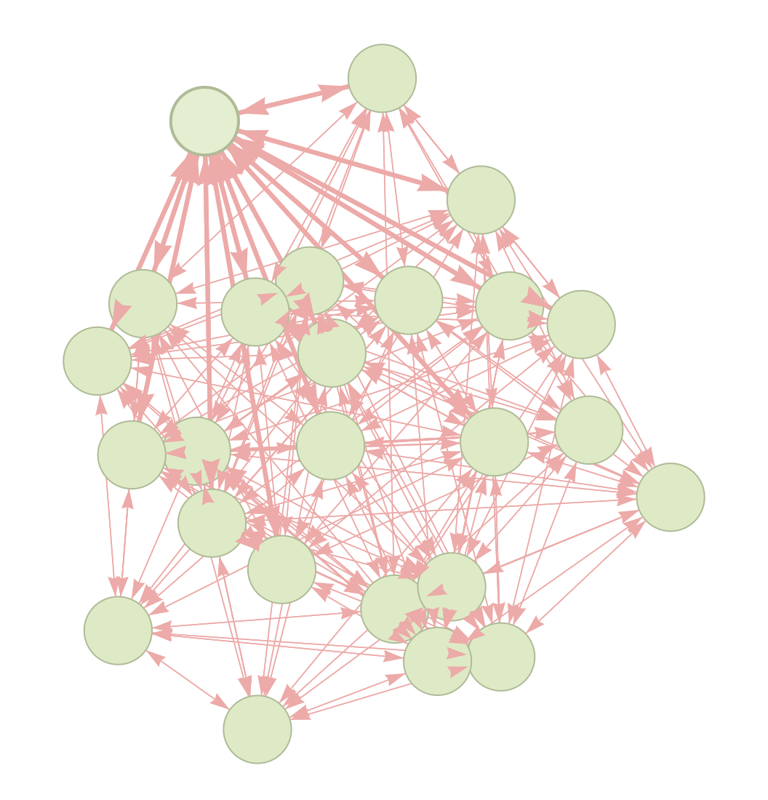
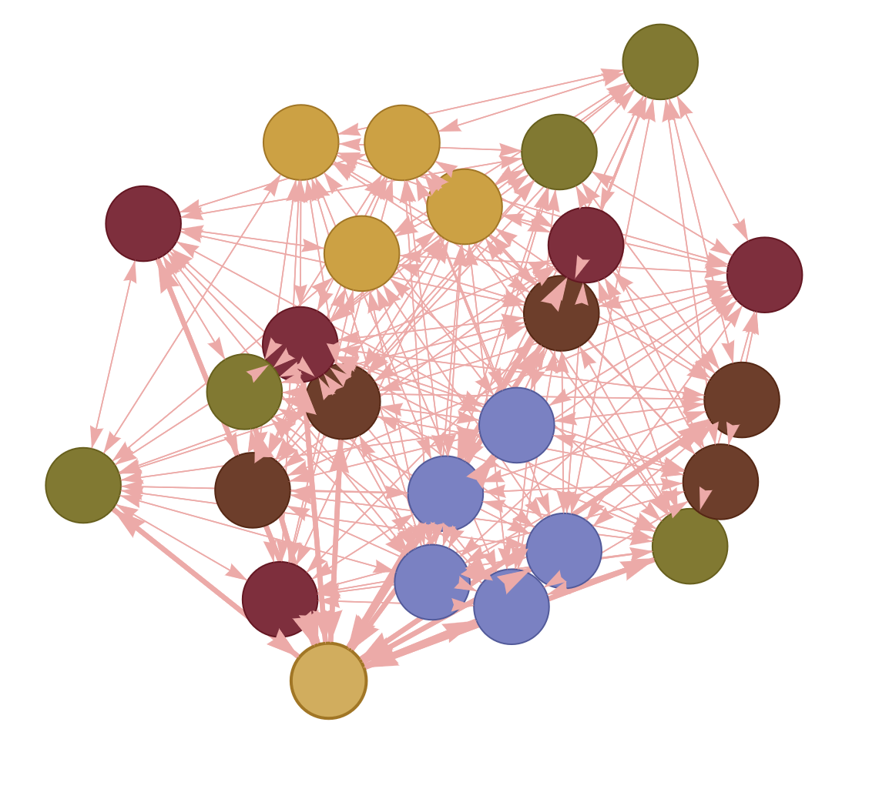

# Graph Coloring

This is an implementation of [graph coloring](https://en.wikipedia.org/wiki/Graph_coloring) problem.

| Graph | Colored |
| ----- | ------- |
|||

## Build

[`graph_colorization.cpp`](./graph_colorization.cpp) is the main file and contains the implementation. To build a CLI application you need to run the command below:

```bash
g++ -std=c++17 -O3 graph_colorization.cpp
```

Please, pay attention that app requires **C++ 17**. You should use one of the [compilers that support](https://en.cppreference.com/w/cpp/compiler_support/17) the standart.

## Algorithm

Let me breifly describe the approach used in this project.

I am using [DSatur algorithm](https://en.wikipedia.org/wiki/DSatur) by Daniel Brélaz to colorize the graph.
DSatur is a heuristic greedy graph colouring algorithm.

As any greedy approach it is considering the verticies
in a specific order assigning to them the smallest possible color.

To do so the algorithm is dynamically (i.e. at every step) choosing the next vertex by picking a vertex
the largest number of different colors among the vertices adjacent to the one under consideration.
Once the vertex has been coloured, the algorithm considers ramining uncolored vertices. If there is a tie
between a few vertices the next step is to consider their degree in uncolored subgraph.

## Output

The output of one program run can be found in **below** or in [`report.csv`](./report.csv).

**Please, do pay attention, that `report.csv` also contains the solution!**

```bash
            Instance    Colors      Time, sec
         myciel3.col         4              0
         myciel7.col         8          0.001
 latin_square_10.col       130          0.141
         school1.col        17          0.007
     school1_nsh.col        28          0.005
      mulsol.i.1.col        49          0.001
      inithx.i.1.col        54          0.007
            anna.col        11              0
            huck.col        11              0
            jean.col        10              0
       miles1000.col        42          0.001
       miles1500.col        73          0.002
      fpsol2.i.1.col        65          0.004
        le450_5a.col        10          0.002
       le450_15b.col        17          0.003
       le450_25a.col        25          0.003
        games120.col         9              0
      queen11_11.col        14          0.001
        queen5_5.col         5              0
```

If you're interested in visualising colors you can take a look 
at [`colors_report.txt`](./colors_report.txt). This file contains all
colors that have been assigned to the vertices in order of their appearance in
a file containing the graph.

## Misc

### Changes to the template

The most significant change made to the original template is the `Check` method. 
Instead of considering `0` as **not a color**, I am considering `kColorNoColor = -1`.
I am using colors as an index in other arrays, therefore indexing them from `0` seems
more convenient.

### Visualisation

Additionally, to the `Check` method I prepared a small Python script
to visualise graphs. You can find the script at [graph_visualisation.py](./graph_visualisation.py).

You need [streamlit](https://pypi.org/project/streamlit/) and [steamlit_agraph](https://pypi.org/project/streamlit-agraph/) installed. To run visualisation script use the command below:

```bash
streamlit run graph_visualisation.py
```

If you see the interface like the interface below the script is running just fine. Hooray 🎉


### Additional examples

| Graph | Colored |
| ----- | ------- |
|||
|||
|||

Thank you for reading!
