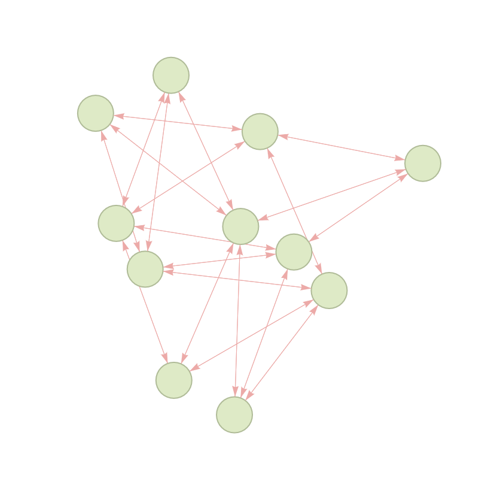
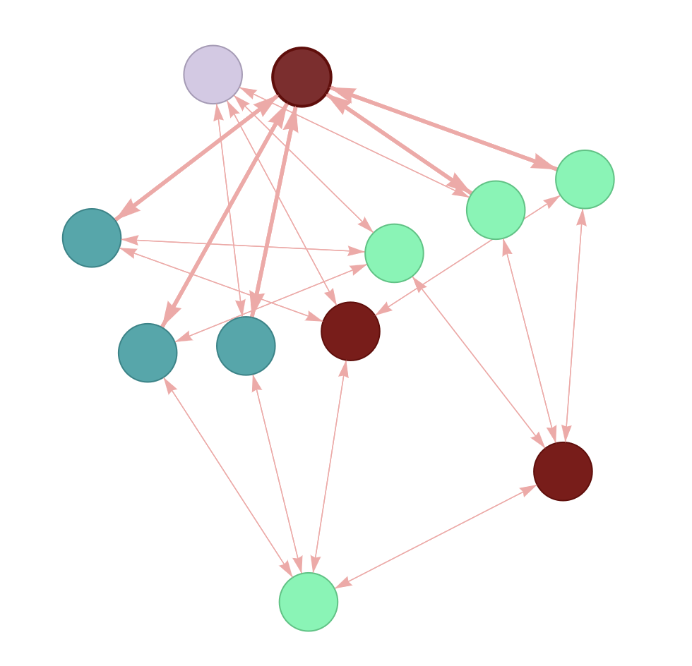
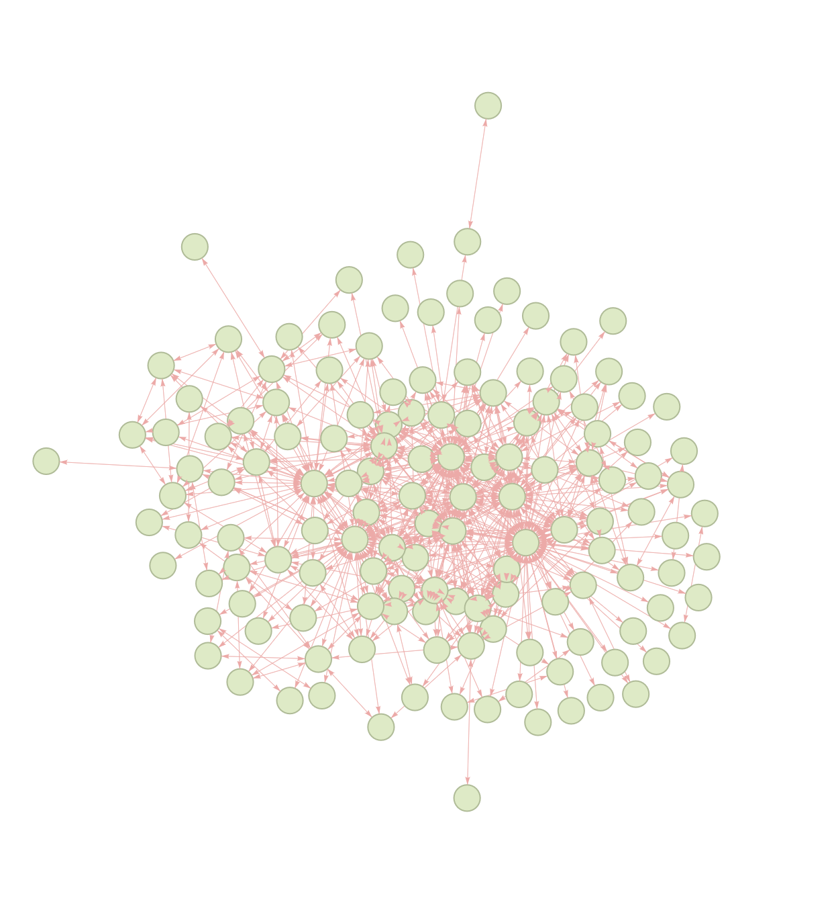
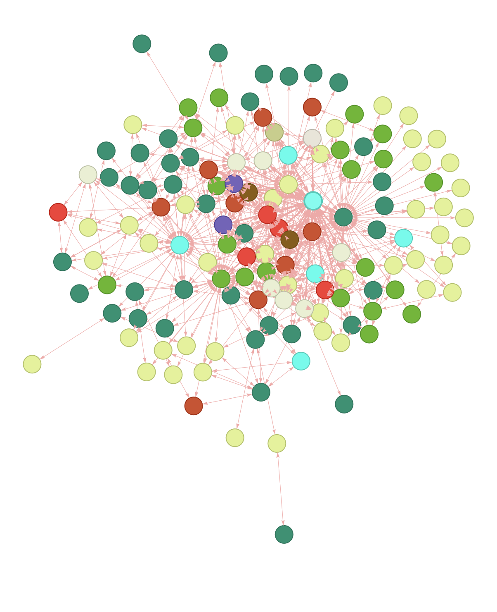
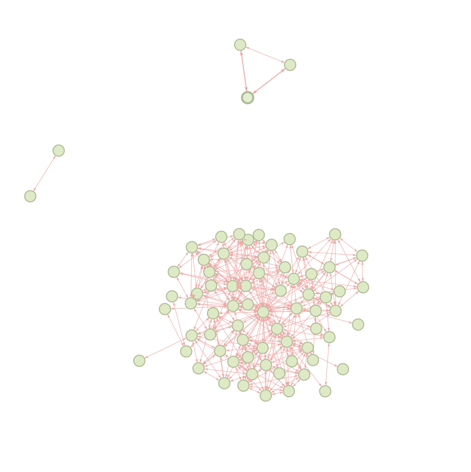
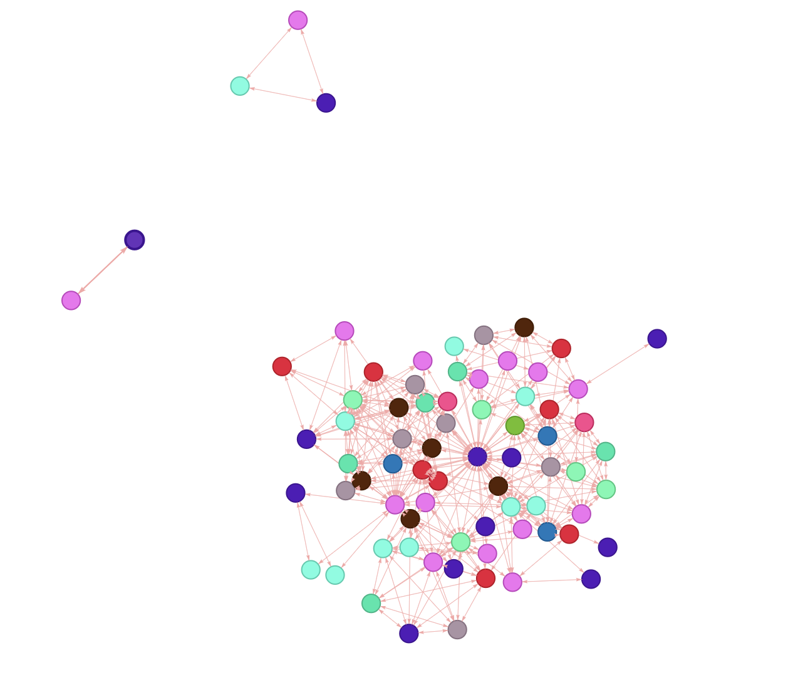

# Graph Coloring

This is an implementation of graph coloring problem.

| Graph | Colored |
| ----- | ------- |
|||

## Build

```bash
g++ -std=c++17 graph_colorization.cpp
```

## Algorithm

I am using DSatur algorithm to colorize the graph.

Algorithm uses greedy approach by considering the verticies
in a specific order and assining to them the smallest available color
not used in the local neighbourhood.

The ordering of the consideration relies on an heuristic:
the ordering is built dynamically choosing next the vertex adjacent to
the largest number of different colors.

## Output

Program report can be found in [`output_report.csv`](./output_report.csv)

```bash
            Instance    Colors      Time, sec
         myciel3.col         4              0
         myciel7.col         8          0.003
 latin_square_10.col         2              0
         school1.col        17           0.02
     school1_nsh.col        28          0.015
      mulsol.i.1.col        49          0.005
      inithx.i.1.col        54          0.023
            anna.col        11          0.001
            huck.col        11              0
            jean.col        10              0
       miles1000.col        42          0.004
       miles1500.col        73          0.006
      fpsol2.i.1.col        65          0.015
        le450_5a.col        10          0.007
       le450_15b.col        17           0.01
       le450_25a.col        25           0.01
        games120.col         9          0.001
      queen11_11.col        14          0.002
        queen5_5.col         5              0
```

If you're interested in visualising colors or just want to validate the output
you can take a look at [`colors_report.txt`](./colors_report.txt). This file contains all
colors that have been assigned to the vertices.

The ordering of a color label is an id of the vertex in the list.

## Misc

### Changes to original code

I modififed `Check` method. Instead of considering `0` as no color, I am considering
`kColorNoColor = -1` as I am using colors as an index in other arrays in the algorithm
and it is more convenient to use them this way.

### Visualisation

In order to visualise graph I did a small script.
You can find the script at [graph_visualisation.py](./graph_visualisation.py).

To run the script:

```bash
streamlit run graph_visualisation.py
```

You will see the interface like the interface below:


### Additional examples

| Graph | Colored |
| ----- | ------- |
|||
|||

